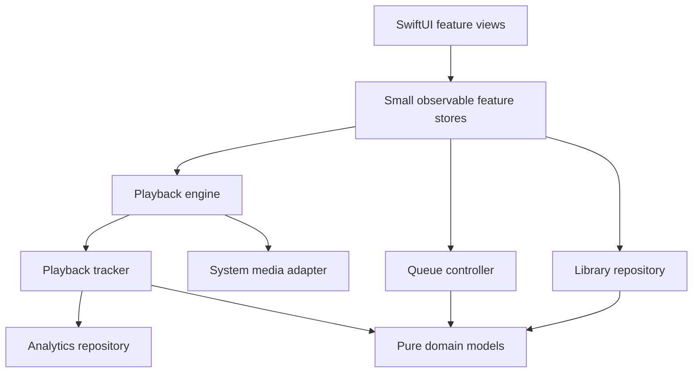

# Architecture review

## Assessment

Luma is organized by feature and uses SwiftUI Observation consistently. It is a working, tested single-target application, with an MVVM-like observable state object. It is **not yet a cleanly separated MVVM/service/repository architecture**: `MusicPlayer` is both the presentation-facing store and the implementation of most application services.

This review covers the current source, including gapless scheduling, SQLite storage/recovery, and backup restoration. The risks below are source-level findings; large-library performance has not been profiled on hardware.

## Findings, in priority order

### 1. Addressed — Persistence has a repository and recovery policy

`LibraryRepository` owns serial SQLite reads/writes, transaction boundaries, checksummed current/previous snapshots, a separate recovery file, and preservation of damaged database files. Pending writes coalesce and encoding runs off the main actor. `MusicPlayer` coordinates saves and exposes failures; unreadable data locks automatic saves instead of silently becoming an empty library. Old UserDefaults data migrates on first use. `LibraryBackup` provides versioned portable JSON export, safe file matching, preview, and explicit restore.

The database deliberately stores checksummed library snapshots rather than normalized song/history tables. This keeps migrations and recovery atomic, but serialization still scales with total history. Normalize high-volume history and add incremental queries if profiling identifies a bottleneck. Startup load is synchronous to provide a consistent initial library.

### 2. Medium — MusicPlayer has too many independent responsibilities

**Location:** `Luma/MusicPlayer.swift:7`.

The observable facade coordinates audio transport, imports, playlists, favorites, lyrics, queue/history, sleep timers, analytics, artwork, and lock-screen commands. SQLite I/O and backup validation are extracted; `GaplessScheduler` owns prepared successor playback on the audio-device clock. Every screen receives this object through the environment. This is convenient now, but changes to unrelated features require editing and retesting the same class. The `systemIntegration` switch helps tests, but also shows that platform behavior and domain behavior share one object.

**Recommendation:** keep a small observable presentation facade and extract cohesive services incrementally:

- `PlaybackEngine`: AVAudioPlayer/session lifecycle and transport.
- `QueueController`: collection context, shuffle/repeat, upcoming entries, previous history.
- `LibraryRepository` / `LibraryStore`: tracks, playlists, favorites, lyrics, migrations.
- `PlaybackTracker`: session accounting and analytics storage.
- `SystemMediaController`: remote commands and now-playing information.

Inject small protocols at boundaries where tests or alternate implementations actually need them. Separate Swift packages are optional; feature folders and clear service interfaces are sufficient at this size.

### 3. Medium — Lyrics parsing repeats during presentation updates

**Location:** `Luma/LyricsView.swift`.

Lyrics are parsed by an uncached computed property, including whenever playback position changes and when lyric rows query synchronization state. This repeats regular-expression creation and parsing on the UI actor. The earlier artwork I/O finding has been addressed: `ArtworkLoader` now decodes and downsamples images off the main actor, shares a bounded cache, and extracts the dominant background color. Views load artwork only when its URL changes.

**Recommendation:** parse lyrics once when text changes, then update only the active line as playback moves. Cache analytics summaries or publish them at a slower cadence if history size makes updates expensive.

### 4. Low — Domain models know about concrete infrastructure

**Location:** `Luma/Models.swift:15`.

`Track.url` reaches into `MusicPlayer.documents` and `Bundle.main`. This makes the model dependent on its higher-level owner and duplicates URL resolution already exposed by `MusicPlayer.url(for:)`. The latter honors an injected documents directory; the former always uses the default one.

**Recommendation:** keep `Track` as metadata plus a file identifier. Let an injected file locator or repository resolve bundled/imported URLs. Move `LyricsDocument` into its own domain file as the parser evolves.

## What is already working well

- Feature views are separated: library, playlists, player tools, lyrics, analytics, and artwork.
- The visualizer has a dedicated `AudioVisualizer` metering model and `AudioVisualizerView` renderer. `MusicPlayer` only attaches the current audio source and resets the bars on seeks; high-frequency level changes do not mutate the main playback store. The view gates sampling by visibility, playback, scene activity, and Reduce Motion.
- Online lyrics use an injected `LyricsSearching` protocol and a shared `LRCLIBClient` actor. Networking, decoding, request serialization, and rate-limit cooldowns stay outside `MusicPlayer`. The lookup view owns temporary results and cancellation; explicit saves reuse existing lyric persistence. API tests use a URLProtocol stub and UI tests use a separate fixture client.
- `@State` owns temporary UI state; shared application state uses `@Observable` on the main actor.
- Shared collections are generally `private(set)` and mutated through intent methods.
- Tracks/playlists/queue entries have explicit identities. Duplicate queued songs receive independent IDs.
- `ListeningAnalytics`, `AnalyticsSummary`, and `LyricsDocument` are value-based logic with deterministic tests; time/calendar inputs can be injected into analytics.
- Audio importing and metadata extraction run in a detached task rather than doing file copies on the UI actor.
- `FLACMetadata` independently parses bounded native Vorbis comments and applies supported tags to track metadata. Existing imports refresh off the main actor; results merge by song ID and filename so deleted songs cannot be reintroduced. Analytics metadata updates preserve listening totals and session progress.
- Native FLAC picture parsing is isolated in `EmbeddedArtwork`, with bounded reads and image validation. `ArtworkLoader` uses it to recover covers for existing imports without copying audio again. Tests cover malformed metadata, front-cover preference, byte-preserving import, and native 24-bit / 96 kHz decoding.
- Production libraries start empty. Starter-song migration preserves imported tracks, while test audio belongs only to the test target or explicitly seeded debug UI-test libraries.
- Preferences and documents locations are injected for isolated tests. UI tests also use their own library.
- Timers, notification observers, and remote-command targets are cleaned up.
- Tests cover queue behavior, playlist persistence, imports/deletion, lyrics, sleep, analytics, and complete UI flows.

## Dependency direction to aim for

Persistence and successor scheduling now have explicit boundaries. The next useful step is extracting queue logic and the remaining transport/session lifecycle, with behavior tests retained. This does not require replacing SwiftUI or adopting a large architecture framework.
