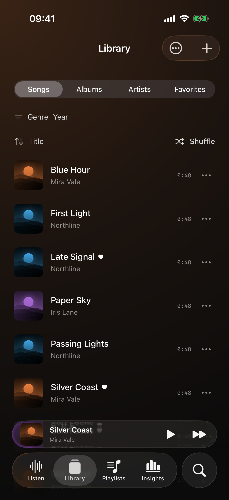
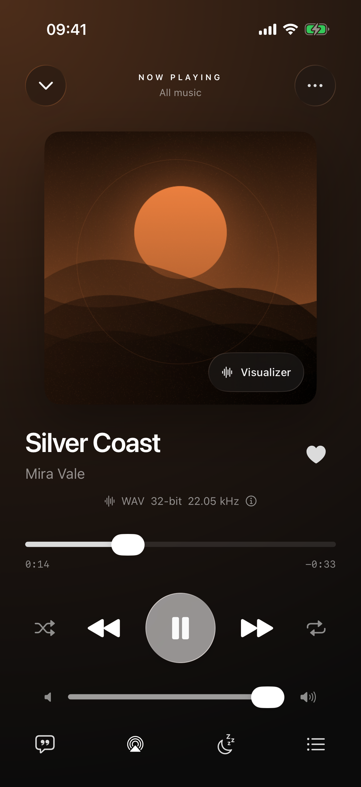
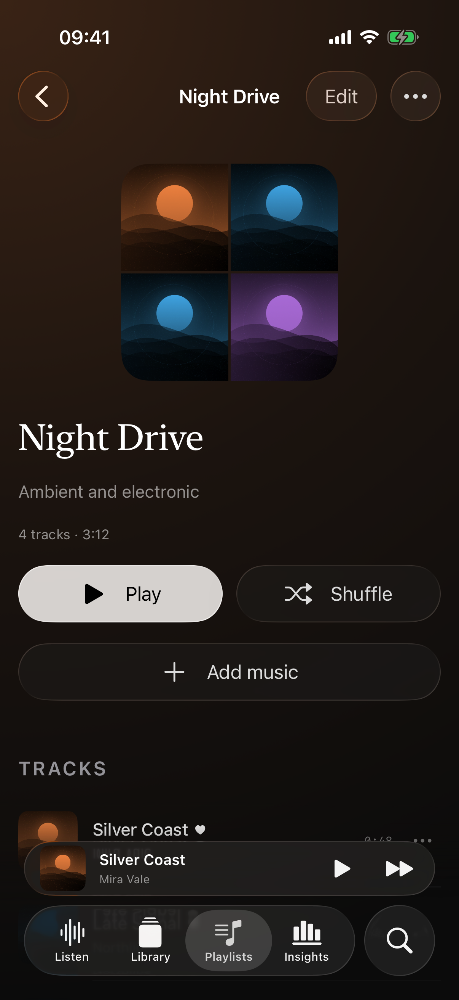
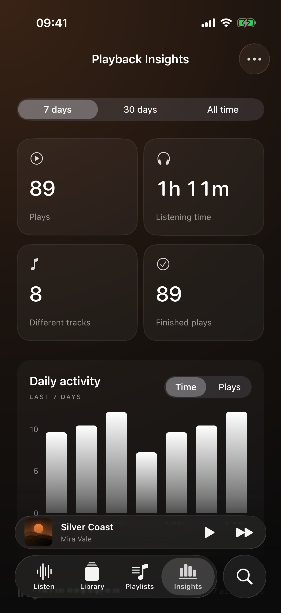

# Luma

Version **1.0.0** · [GitHub](https://github.com/knp-org/luma-ios) · [AGPL-3.0](LICENSE)

A local music player for **iOS 26+**, built with SwiftUI and AVFoundation. Luma pairs silver Liquid Glass controls with full-color album artwork and subtle backgrounds drawn from the current cover.

Import your own music, organize playlists, follow lyrics, and explore your listening history. Playback works offline, with no account or subscription. New installations start with an empty library.

## Screenshots

| Library | Now Playing |
| :---: | :---: |
|  |  |
| **Playlists** | **Playback Insights** |
|  |  |

Captured from the app on an iPhone 17 Pro simulator. Song, artist, album, and playlist names are fictional; artwork is generated locally and listening history is synthetic. The screenshot library uses silent test audio and is excluded from Release builds. No demo music is bundled with the app. [View the Listen screen](Screenshots/listen.png) · [Recreate these screenshots](Screenshots/README.md).

## Features

| Area | Included |
| --- | --- |
| **Playback** | Native FLAC playback; MP3, M4A, WAV, and AIFF support; seek, shuffle, repeat one/all, gapless scheduling, playback speed, optional Track/Album ReplayGain, and sleep timers |
| **Library** | Songs, albums, artists, favorites, recent tracks, search, genre/year filters, album-artist grouping, and disc/track ordering |
| **Playlists & queue** | Create and edit playlists, add multiple songs at once, reorder or remove tracks, playlist search, play next/later, and an editable upcoming queue |
| **Lyrics** | Embedded lyrics, text and LRC import/export, editing, timed follow-along and tap-to-seek, plus free online search and offline saving through [LRCLIB](https://lrclib.net) |
| **Insights** | Most/least-played songs, top artists and albums, listening time, completed plays, daily activity, and 7-day/30-day/all-time views |
| **Import & file tools** | Multiple-file import, progress and duplicate detection, native FLAC tags and embedded covers, metadata refresh, original-file sharing, and single/bulk deletion |
| **Library storage** | Local SQLite persistence, recovery snapshots, saved playback position, and JSON backup/restore for library data |
| **Player experience** | Music-responsive vertical bars, AirPlay, background playback, Lock Screen controls, VoiceOver labels, reduced-motion support, and light/dark/tinted app icons |

The visualizer responds to audio amplitude and peaks; its bars do not represent individual frequency bands. The app interface uses dark backgrounds; light/dark/tinted appearances apply to the app icon.

## Build and run

Requirements: **Xcode 26.3 or later** and an **iOS 26+** simulator or iPhone. Development has been validated with Xcode 26.6. No third-party packages or API keys are required.

1. Open `Luma.xcodeproj` in Xcode.
2. Select the **Luma** scheme and an iPhone simulator.
3. Press **⌘R**.
4. Tap **Import music**, or open **Library → +**, to choose audio files from Files.

To run on an iPhone, select your development team under **Signing & Capabilities**, choose the device, and run. The existing bundle identifier, `studio.sonora.sonora`, is retained for continuity with earlier Luma installations.

## Using your library

- **Add several songs to a playlist:** open **Library → … → Select songs**, choose tracks or **Select all**, then **Add to playlist**. Choose an existing playlist or create one. Existing entries are not duplicated.
- **Remove songs:** use selection mode for multiple tracks, or **Library → … → Delete all songs**. Deletion requires confirmation and removes Luma's copies; source files in Files or VLC remain untouched.
- **Refresh FLAC tags:** use **Library → … → Refresh FLAC metadata** to reread embedded metadata from Luma's copies while preserving playlists, favorites, lyrics, and listening history.
- **Download lyrics:** open **Lyrics → Find lyrics online**, search, preview a matching version, and save it. Saved lyrics work offline; replacing existing lyrics requires confirmation.
- **Back up library data:** use **Settings → Export library backup**. Backups include track metadata, playlists, favorites, lyrics, and listening history. Audio files and cover images are separate; import your music before restoring on another device.

## Audio quality

Luma copies original audio bytes without transcoding and uses Apple's native decoder for FLAC. New installations use 1× playback speed, unity track gain, and ReplayGain Off. Track and Album ReplayGain are optional and never modify source files.

Tap the audio-quality row in Now Playing to view the source format, connected output, and actual audio-session sample rate. Luma requests the source rate, but iOS and the output device determine the final signal. Compatible wired headphones or a USB DAC are suitable for lossless output; ordinary Bluetooth headphone connections use lossy codecs. End-to-end bit-perfect playback is not guaranteed.

Gapless scheduling is enabled by default for tracks with matching source sample rates and channel counts. When these differ, Luma uses a normal transition. Luma does not remove silence embedded in a file or crossfade tracks. Audible continuity, route changes, and background behavior require physical-device validation.

## Data and privacy

Music, artwork, playlists, lyrics, and listening history are stored locally. Imports create a copy inside Luma, so they use additional storage. Duplicate detection compares file contents; renamed copies are skipped, while files with different tags may count as different files.

Online lyrics requests happen only when you search. Luma sends the entered track metadata to LRCLIB, without uploading audio or your full library. Lyrics availability and timing depend on the community catalog. `LumaLyricsContact` in `Luma/Info.plist` supplies the project's public URL for LRCLIB's required client identification; keep it current when distributing a fork.

Playback Insights records local listening activity. A play qualifies after 30 seconds or half of a shorter track; seeking does not count skipped time. Removing a song preserves historical totals. **Insights → … → Reset playback insights** clears those statistics.

Apple Music/Spotify streaming, DRM playback, cloud sync, CarPlay, equalization, and crossfade are not currently integrated.

## Development

Feature views are separated from playback, metadata parsing, artwork loading, lyrics networking, analytics, and persistence. `MusicPlayer` coordinates the app; focused services handle scheduling, storage, and file processing. See the [architecture review](Docs/ArchitectureReview.md) for module responsibilities and remaining coupling.

| Path | Purpose |
| --- | --- |
| `Luma/` | SwiftUI screens, models, playback, and services |
| `LumaTests/` | Unit and integration tests with isolated files and databases |
| `LumaUITests/` | User flows and screenshot capture with an isolated library |
| `Screenshots/` | Documentation images and capture instructions |
| `Scripts/` | Resource and app-icon generation |

Run tests with **⌘U**, or from the project directory:

```sh
xcodebuild -project Luma.xcodeproj -scheme Luma \
  -destination 'platform=iOS Simulator,name=iPhone 17 Pro,OS=26.2' \
  -parallel-testing-enabled NO test CODE_SIGNING_ALLOWED=NO
```

Choose an installed iOS 26+ simulator if that destination is unavailable. Tests cover playback and queue behavior, playlists, imports and deletion, FLAC metadata, lyrics, listening statistics, persistence, backup recovery, and gapless scheduling. Lyrics API tests use local stubs and do not depend on the live catalog.

`logo.png` is the source for the app's light, dark, and tinted icon variants. Regenerate them with:

```sh
swift Scripts/generate_logo_assets.swift
```

## License

Luma is licensed under the **GNU Affero General Public License v3.0 only** (`AGPL-3.0-only`). See [LICENSE](LICENSE) for the full terms.
